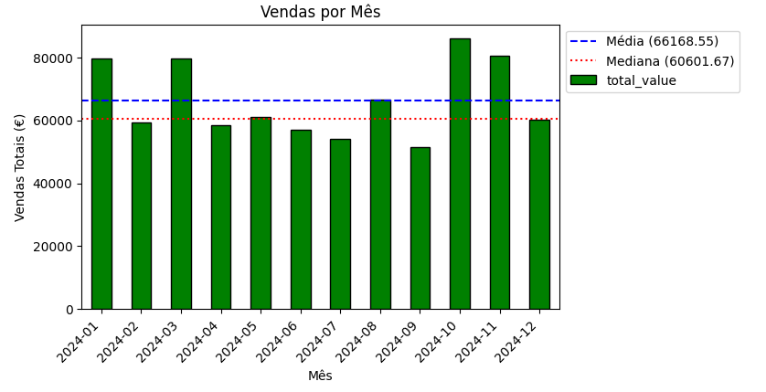
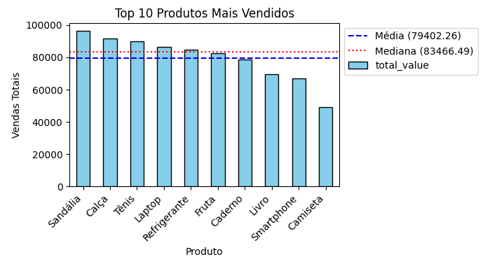
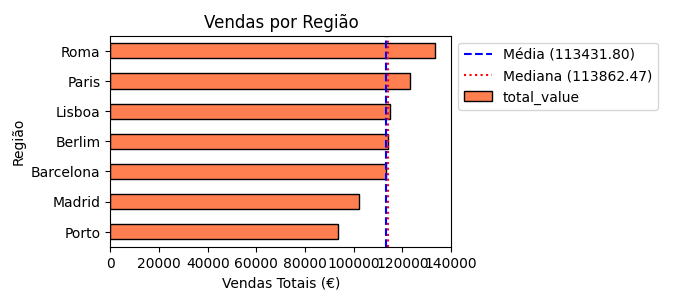

  


# Projeto ETL e Análise de Vendas 2024

📈 Transformar dados em decisões é mais do que uma habilidade técnica — é uma forma de pensar. 

🔄 Neste projeto, desenvolvi a primeira parte de um pipeline ETL completo para tratar e analisar dados de vendas fictícias, enfrentando problemas reais como formatos inconsistentes, valores corrompidos e categorias duplicadas. Utilizei Pandas e Matplotlib para limpar, padronizar e estruturar os dados, gerando visualizações com contexto estatístico que revelam padrões, sazonalidades e oportunidades de negócio.

🌐Os próximos passos serão:

 - Elaborar análises estatísticas mais densas
 - Dockerizar o projeto e orquestrar com Airflow
 - Transportar o projeto para a nuvem (AWS)

🎯Mais do que entregar gráficos, este projeto mostra a importância de identificar problemas, propor soluções e comunicar resultados com clareza.

---
<br>
## Estrutura do Projeto

```
├── data/
│ └── sales_2024.csv
├── assets/
│ ├── sales_by_month.png
│ ├── top_products.png
│ └── sales_by_region.png
├── sales_clean.py
├── sales_analysis.py
└── README.md
```

---

<br>

## 1. Exemplo de Dados

### Antes do ETL (dados brutos)
```csv
transaction_id,date,customer_id,product,category,quantity,price,store_location
1,16/09/2024,CUST0249,Livro,Educação,5,461.82,Roma
2,21/11/2024,CUST0419,Refrigerante,ALIMENTOS,10,314.51,Lisboa
3,01-11-2024,CUST0236,Tênis,Calçados,2,143.49,Porto
4,05-13-2024,CUST0265,Tênis,Calçados,2,360.22,Berlim
5,2024-08-19,CUST0296,Laptop,ELETRÔNICOS,6,28.17,Madrid
6,08-18-2024,CUST0367,Sandália,Calçados,8,197.21,Barcelona
7,2024-02-25,CUST0432,Sandália,Calçados,8,393.11,Lisboa
8,10-13-2024,CUST0054,Livro,Educação,8,35.13,Roma
9,02/05/2024,CUST0229,Tênis,Calçados,4,208.47,Barcelona
10,12-01-2024,CUST0456,Laptop,Eletrônicos,5,"12,44",Roma
11,2024-10-21,CUST0082,Fruta,Alimentos,2,"134,37",Roma
12,11/10/2024,CUST0008,Camiseta,Vestuário,7,"455,17",Barcelona
13,08-28-2024,CUST0200,Camiseta,Vestuário,5,418.85,Lisboa
14,13/11/2024,CUST0340,Laptop,ELETRÔNICOS,1,455.62,Roma
15,08-18-2024,CUST0446,Sandália,Calçados,10,"138,04",Paris
16,2024-05-25,CUST0205,Refrigerante,Alimentos,9,"159,73",Lisboa
17,09-03-2024,CUST0281,Fruta,Alimentos,5,323.97,Berlim
18,28/08/2024,CUST0433,Refrigerante,Alimentos,1,126.39,Madrid
19,07-12-2024,CUST0201,Refrigerante,Alimentos,5,245.04,Roma
20,11-18-2024,CUST0422,Laptop,Eletrônicos,10,344.82,Lisboa
21,05-08-2024,CUST0226,Sandália,CALÇADOS,10,349.86,Barcelona
22,02-26-2024,CUST0118,Smartphone,Eletrônicos,2,259.45,Lisboa
23,2024-01-02,CUST0257,Sandália,Calçados,9,464.03,Porto
24,03-18-2024,CUST0358,Fruta,Alimentos,9,412.24,Lisboa
25,07/08/2024,CUST0301,Calça,Vestuário,3,295.37,Paris
26,03-06-2024,CUST0267,Camiseta,Vestuário,5,387.34,Madrid
```
<br>

### Problemas detectados:

- Datas em formatos diferentes ("01/01/2024", "04-01-2024", "2024-05-25").

- Valores monetários com vírgula ("2,50") e ponto ("1.00").

- Inconsistência nos nomes de categorias ("CALÇADOS", "Calçados").
<br>

### Depois do ETL (dados limpos)

```csv
    transaction_id       date customer_id       product     category  quantity   price store_location  total_value year_month
0                1 2024-09-16    CUST0249         Livro     Educação         5  461.82           Roma      2309.10    2024-09
1                2 2024-11-21    CUST0419  Refrigerante    Alimentos        10  314.51         Lisboa      3145.10    2024-11
8                9 2024-05-02    CUST0229         Tênis     Calçados         4  208.47      Barcelona       833.88    2024-05
11              12 2024-10-11    CUST0008      Camiseta    Vestuário         7  455.17      Barcelona      3186.19    2024-10
13              14 2024-11-13    CUST0340        Laptop  Eletrônicos         1  455.62           Roma       455.62    2024-11
```
<br>

### Transformações aplicadas:

- Datas convertidas para datetime.

- Valores monetários convertidos para float.

- Quantidade preenchida ou linhas com valor nulo removidas.

- Padronização de nomes de produtos e regiões.
- Coluna adicional year_month criada para agregações mensais.

---

<br>

## 2. ETL - `sales_clean.py`

O ETL realiza limpeza, transformação e retorna um `DataFrame` pronto para análise.

```python
import pandas as pd

def run_etl():
    df = pd.read_csv("data/sales_2024.csv")

    # Corrige datas
    df["date"] = pd.to_datetime(df["date"], errors="coerce")

    # Converte valores e quantidade
    df["total_value"] = pd.to_numeric(df["total_value"].str.replace(",", "."), errors="coerce")
    df["quantity"] = pd.to_numeric(df["quantity"], errors="coerce")

    # Remove linhas com dados faltantes
    df = df.dropna(subset=["date", "total_value", "quantity", "product", "store_location"])

    # Padroniza nomes
    df["product"] = df["product"].str.title().str.strip()
    df["store_location"] = df["store_location"].str.title().str.strip()

    # Coluna auxiliar para agregações mensais
    df["year_month"] = df["date"].dt.to_period("M")

    return df

```

--- 

<br>

## 3. Análise e Gráficos - `sales_analysis.py`

O script gera três gráficos com linhas pontilhadas de **média e mediana**.

```python
import pandas as pd
from sales_clean import run_etl
import matplotlib.pyplot as plt

def analyze_sales():
    transformed_data = run_etl()
    print("Prévia dos dados transformados:")
    print(transformed_data.head())

    # Vendas por mês
    sales_over_time = transformed_data.groupby("year_month")["total_value"].sum()
    plt.figure(figsize=(12, 6))
    sales_over_time.plot(kind="bar", color="green", edgecolor="black")
    plt.axhline(sales_over_time.mean(), color="blue", linestyle="--", label="Média")
    plt.axhline(sales_over_time.median(), color="red", linestyle=":", label="Mediana")
    plt.title("Vendas por Mês")
    plt.xlabel("Mês")
    plt.ylabel("Vendas Totais (€)")
    plt.xticks(rotation=45, ha="right")
    plt.legend(loc="upper left", bbox_to_anchor=(1,1))
    plt.tight_layout()
    plt.savefig("sales_by_month.png", bbox_inches="tight")
    plt.show()

    # Top 10 produtos
    top_products = transformed_data.groupby("product")["total_value"].sum().sort_values(ascending=False).head(10)
    plt.figure(figsize=(10, 6))
    top_products.plot(kind="bar", color="skyblue", edgecolor="black")
    plt.axhline(top_products.mean(), color="blue", linestyle="--", label="Média")
    plt.axhline(top_products.median(), color="red", linestyle=":", label="Mediana")
    plt.title("Top 10 Produtos Mais Vendidos")
    plt.xlabel("Produto")
    plt.ylabel("Vendas Totais")
    plt.xticks(rotation=45, ha="right")
    plt.legend(loc="upper left", bbox_to_anchor=(1,1))
    plt.tight_layout()
    plt.savefig("top_products.png", bbox_inches="tight")
    plt.show()

    # Vendas por região
    sales_by_region = transformed_data.groupby("store_location")["total_value"].sum().sort_values()
    plt.figure(figsize=(8, 5))
    sales_by_region.plot(kind="barh", color="coral", edgecolor="black")
    plt.axvline(sales_by_region.mean(), color="blue", linestyle="--", label="Média")
    plt.axvline(sales_by_region.median(), color="red", linestyle=":", label="Mediana")
    plt.title("Vendas por Região")
    plt.xlabel("Vendas Totais (€)")
    plt.ylabel("Região")
    plt.legend(loc="upper left", bbox_to_anchor=(1,1))
    plt.tight_layout()
    plt.savefig("sales_by_region.png", bbox_inches="tight")
    plt.show()

if __name__ == "__main__":
    analyze_sales()

```
<br>

## 📊 Gráficos Gerados

Gráfico 1: Vendas por mês




<br>

Gráfico 2: Top 10 produtos mais vendidos




<br>

Gráfico 3: Vendas por região




---

<br>

## 4. Considerações Finais

Este projeto demonstrou um pipeline ETL completo e simples, aplicado a dados de vendas fictícios, mostrando claramente a importância de:

- **Limpeza e padronização de dados**: Garantir que datas, valores e categorias estejam consistentes é fundamental para análises confiáveis.  
- **Transformações inteligentes**: A criação de colunas auxiliares, como `year_month`, permite agregações e visualizações mais significativas.  
- **Visualização de dados**: Gráficos com linhas de média e mediana ajudam a identificar tendências e pontos fora do padrão, oferecendo insights valiosos para a tomada de decisão.  

Além disso, este projeto serve como **base para melhorias futuras**, como:

- Análise de sazonalidade por categoria
- Ticket médio por região
- Frequência de compra por cliente
- Elasticidade de preço por produto
- Análise de mix de produtos por região
- Detecção de outliers operacionais
- Correlação entre categorias e localização

E ainda:

- Automação do ETL e geração de gráficos com **Airflow**.  
- Armazenamento e versionamento de dados em **AWS S3**.  
- Dashboards interativos para análise em tempo real usando **Plotly ou Dash**.  
- Expansão para análise de promoções, clientes, categorias e regiões específicas.  
- Criar dashboards interativos (Plotly ou Dash).
- Expandir análises para clientes, promoções ou categorias.

Por fim, este projeto evidencia como um pipeline simples, quando bem estruturado, pode gerar informações relevantes e confiáveis, servindo tanto para aprendizado quanto como protótipo para aplicações reais em empresas de qualquer ramo.


